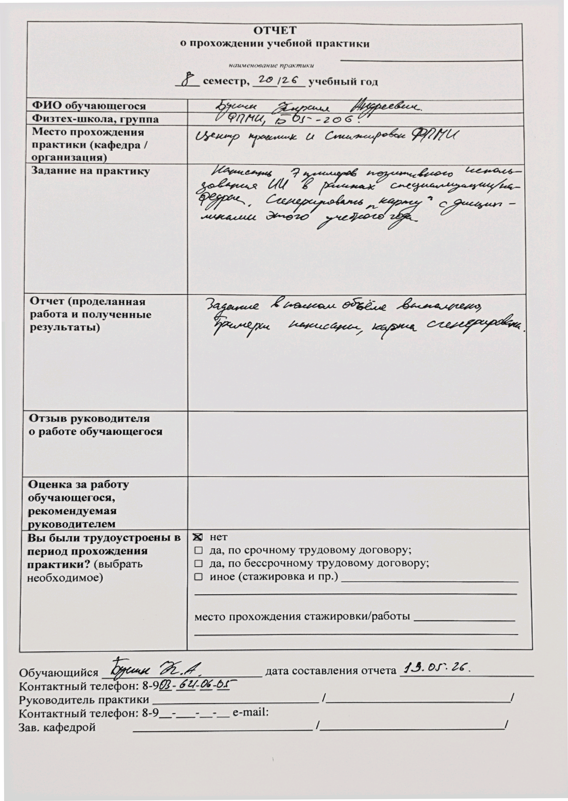
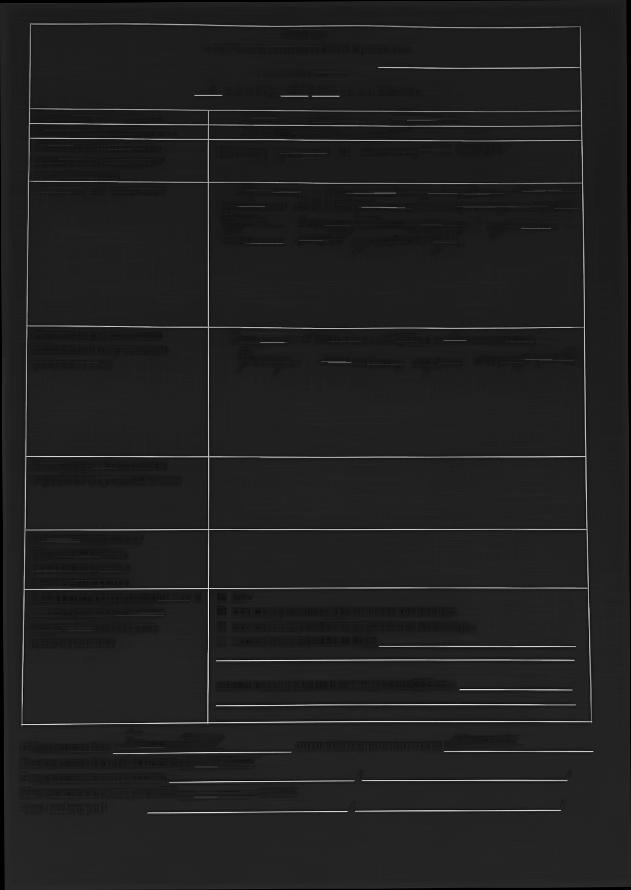
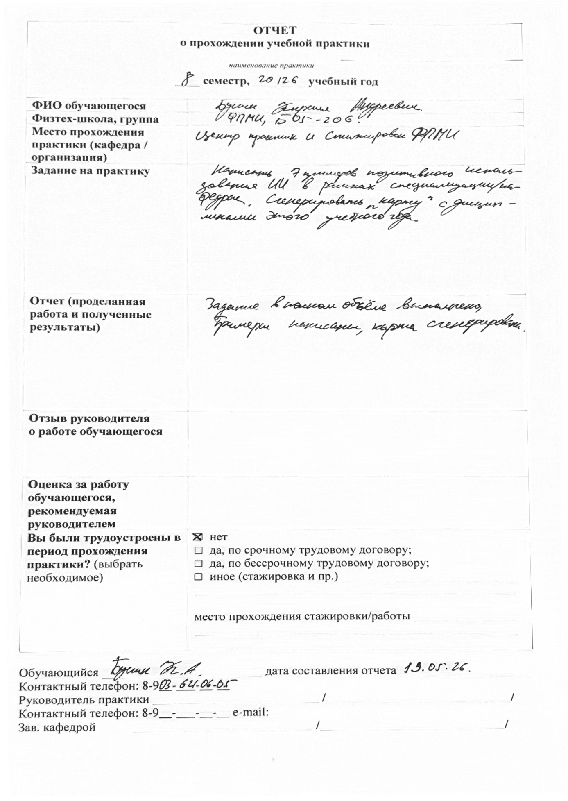

# HafMorf

Input:

```text
./data/target.Pdf
```

Result directory:

```text
./result/
```

## Launch

From this directory:

```bash
python -m src.hafmorf \
  --input <input-path> \
  --output-dir <out-dir>
```

Optional parameters:

```bash
python -m src.hafmorf \
  --input data/target.Pdf \
  --output-dir result \
  --angle-range 15 \
  --angle-step 0.1 \
  --line-scale 0.035
```

## Current Result

### Input:


### Oriented:



### Detected lines:



### Result:


